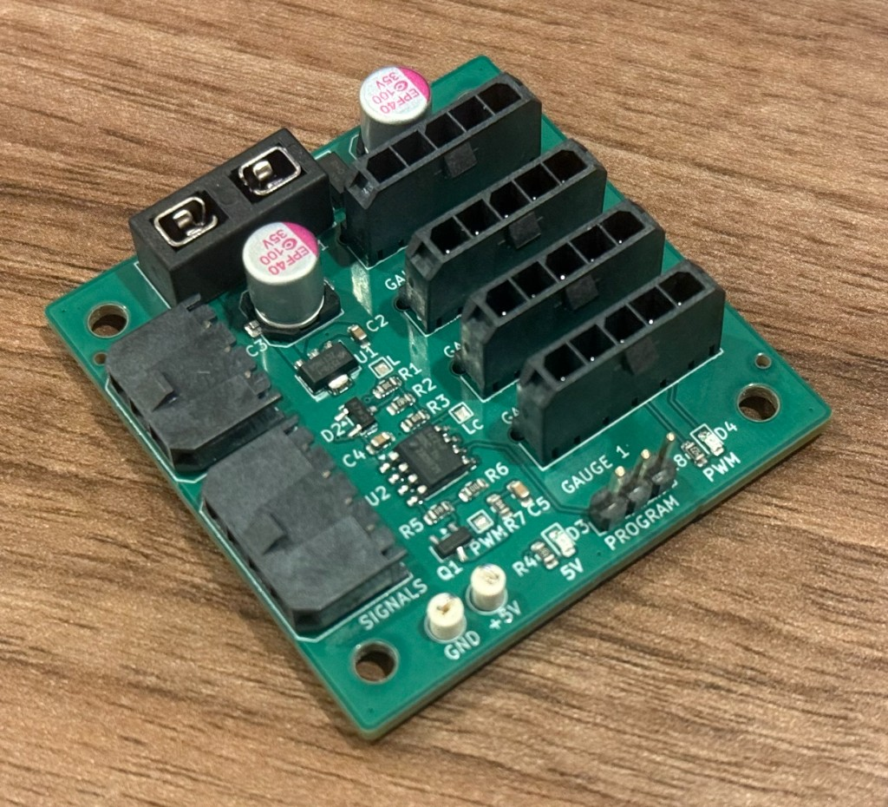
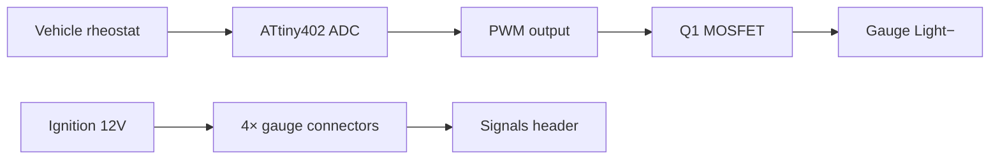

# VDO Breakout

A 4-gauge breakout board for VDO automotive instruments (e.g. Vision Black), with fused 12 V distribution, sender signal routing, and PWM dimming for LED backlighting.



## Overview

VDO gauges (e.g. Vision Black) terminate in **4–5 individual spade connectors**, not a single harness plug: **2 or 3 for the gauge** (12v power, ground, and usually a sender/sense) plus **2 for the bulb** (Light+, Light−). Wiring these directly in a custom dash in place is tedious.

This board consolidates those spade connections into four gauge ports (Molex Micro-Fit) plus dedicated power and signal headers — one harness per gauge instead of a handful of loose spades.

**LED backlighting** does not dim with a stock rheostat alone. An **ATtiny402** reads the vehicle dimmer input and PWM-switches the shared **Light−** return via an **IRLML2502** MOSFET so LED backlights track the dash lighting level.



## Features

- Individual Molex Micro-Fit 3.0 connectors for each gauge (J3–J6)
- Power input protection with mini blade fuse + 15 V TVS
- Single connector for all 4 gauge sender signals (J2)
- Rheostat input on power connector (J1)
- ATtiny402 PWM dimming on shared Light− (enables LED backlighting with rheostat-following brightness)
- UPDI programming header (J7); KiCad sources + production files in [`hardware/`](hardware/)

### Gauge connectors J3–J6

Molex 43650-0515 (one per gauge). PCB silk: `L−  L+  GND  12V  S^N`

| Pin | Signal |
| --- | ------ |
| 1 | Sense (sender) |
| 2 | +12V (ignition-switched gauge power) |
| 3 | GND |
| 4 | Light+ |
| 5 | Light− (PWM-switched) |

J3 = Gauge 1 … J6 = Gauge 4.

### Power J1

Molex 43650-0300

| Pin | Signal |
| --- | ------ |
| 1 | Lighting rheostat |
| 2 | GND |
| 3 | Ignition 12V |

### Signals J2

Molex 43650-0400

| Pin | Signal |
| --- | ------ |
| 1 | Sense 1 |
| 2 | Sense 2 |
| 3 | Sense 3 |
| 4 | Sense 4 |

### Program J7

2.54 mm pin header

| Pin | Signal |
| --- | ------ |
| 1 | UPDI |
| 2 | GND |
| 3 | +5V |

## Building the board

- Open design: [`hardware/VDO Breakout.kicad_pro`](hardware/VDO%20Breakout.kicad_pro) (KiCad 10)
- BOM: [`hardware/production/bom.csv`](hardware/production/bom.csv) (LCSC part numbers included)
- Gerbers: [`hardware/production/VDO_Breakout.zip`](hardware/production/VDO_Breakout.zip)
- Pick-and-place: [`hardware/production/positions.csv`](hardware/production/positions.csv)

Open items:

- Fuse rating (F1) is not specified in the BOM — choose based on total gauge load.
- LDO is listed as HT75xx; confirm 5 V variant when ordering.

## Firmware

PlatformIO project in [`firmware/`](firmware/). The **ATtiny402** reads the vehicle dimmer on **PA6** (ADC) and PWM-switches gauge Light− on **PA1**.

Two build profiles: `ATtiny402` (incandescent fade timings) and `ATtiny402_LED` (faster fades for LED backlights). Program via UPDI on J7 — see the [firmware README](firmware/README.md) for build and flash instructions.

## Repository layout

```
hardware/     KiCad schematic, PCB, and production outputs
firmware/     ATtiny402 dimming firmware (PlatformIO)
```

## License

- **Hardware** ([`hardware/`](hardware/)): [CC BY-NC-SA 4.0](https://creativecommons.org/licenses/by-nc-sa/4.0/) — non-commercial use; derivatives must use the same license.
- **Firmware** ([`firmware/`](firmware/)): [MIT](firmware/LICENSE)

See [LICENSE.md](LICENSE.md) for details.

## Disclaimer

This is an automotive electrical project. Use at your own risk. Verify all wiring against your vehicle and gauge documentation before connecting power.
